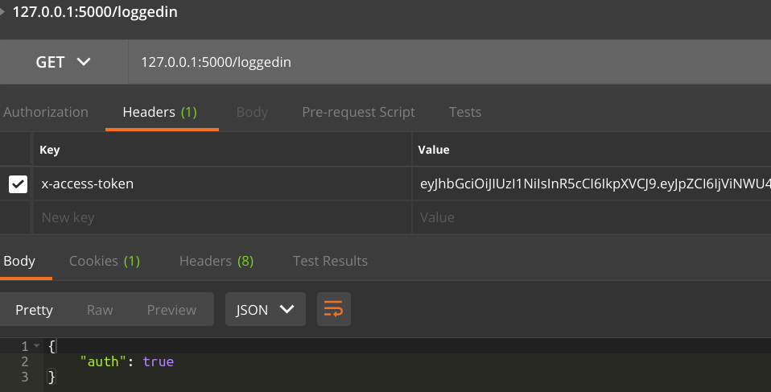

# TODO
1. DONE-ISH Implement Authentication
   1. I think this is good for now?
2. DONE Implement more internal HTTP calls to Python server
3. Allow users to select team names?
   1. Allow setting of static teams
4. Allow uploading of tarballs for attacks
   1. Validate extension and file type on submission
   2. Implement hashing and storage of hash to database.
5. Restructure the server to reflect generic file structure
6. *DONE* Implement Rate Limiting!!! (Prevent brute force on bcrypt)
7. *DONE* Implement Pre-Receive Hook to deny users not in team
  6a. Maybe just cheat and use team name registered under a user as the repo name

# Server DTANM

This is an attempt at transitioning the DTANM framework to a more flexible setup. Currently the DTANM framework relies on static pathing for all interaction with teams. This is an attempt to decentralize this setup such that any number of teams can interact with the server and compete.

## Current Implementation
Basic setup.

Jon and I have reworked the original idea to be as follows:

   	1. Node server to handle authentication/uploading/git repos of teams
  2. Python internal server to handle updates to attacks and team source files
    1. Python server will, upon notice, spawn child processes to begin testing of the source and attacks
    2. Upon team source push all past results will be invalidated and thus need to be recomputed
    3. Upon attack push all teams must be ran against the new attack, thus less overhead for computation
  3. Mongodb
    1. Users for auth
    2. Attacks
       1. Keep track of uploaded attacks and their hashes for denial of resubmission
    3. Results
       1. For Node server to obtain the results from the runs
		2. Client side : REACT
      	1. React Router to set up client side routes to communicate with our Node Server endpoints. 

### Testing

TODO implement mocha + chai testing

### Curl Requests for testing

to make requests using curl we can run the following command to obtain session info:  
```
curl <URL> --cookie-jar cookie --cookie cookie
```

```
curl <URL> --cookie cookie -F "file=@filepath" enpoint
```
This saves the cookie obtained to the file cookie which is then used by the --cookie flag to generate the correct request.

#Docker

https://docs.docker.com/

## Run Docker

to build the image run the following commands from the directory where dtanm is cloned run:  
```
docker build -t cctf_calc .
```
```
docker run -ti --rm cctf_calc -p 80:5000 -p 7005:7005
```
probably can omit the CCTF

### Docker TODO 
On close we need a mounted volume to store a tar ball of all the git repos + results directory

Results need to be a full history and not just current results

#MongoDB

https://www.mongodb.com/

http://mongoosejs.com/

Using Mongoose we can specify a Schema for the user object. Feel free to use this for more than just users.

Currently have Users set to require 5 properties:

* username
* password (min length 5)
* email
* passwordConf
* team (alpha numeric requirement, min length 1 char and max 25)

So the way you can use the mongoose feature is pretty straight forward. You specify the data as JSON within the Schema instantiation. There are plenty of functions that you can implement. An example of this is seen below where I call a validation function within the validate property of the schema item *team*

```
new mongoose.Schema({ 
	team : {
        type: String,
        required: true,
        minlength: 1,
        maxlength: 25,
        validate: {
            validator: function(v) {
                return valid.isAlphanumeric(v);
            },
            message: "{VALUE} is not valid team name",
        },
    }, etc...
 })

```

# Nodejs

Server implementation is done with NodeJS

## Authentication

Authentication is done using Session tokens  + JsonWebTokens (JWT). While sessions could be enough to sustain a full implementation of the application JWT allows us to integrate better with the client side of the application.

### JWT 

Acts as yet another secure feature for this application. The necessity of this is that due to our session objects being relatively simple, we don't want session hijacking to occur. To reduce this possibility we can utilize JWT. This also allows us to check if sessions are out of date with the added benefit of the client side being able to untegrate better with react. 


###  Modules

- express-session
- express
- body-parser
- node-git-server (early beta of module)
- mkdirp (creation of directories)
- multer (file uploading)
- bcryptjs
- mongoose
- MongoClient
- validator
- mmagic
- concurrently
- nodemon
- jsonwebtokens
- ?

#React Client Side

https://reactjs.org/

React will make up the client side of this application. Included with react will be it's complimentary package react-router. Since React is mainly used for single page applications (which we could reduce our front end into) the react router helps us maintain this in a more natural way.

###File Structure

- src
  - (folder) components (where dom elements will live. Add all page logic and such here.)
    - App.js (main entry point into react application.)
    - etc...
  - router.js (specify routes for specific pages)
  - index.js (unlikely that anyone will need to touch this file).

### Add Components + Route

To add a route to the web client it is as simple as adding the component you wish to display via the *routes.js* file under src.

```
    <Route path="/" component={App} />
```

To make a new component you must add a file under the components directory. (Not required but this keeps things organized). Assuming you have created a file, lets call it test.js, you must set it up like this for a simple implementation

```
import React, { Component } from 'react';

class SignIn extends Component {
    render(){
        return(
            <div >
                <form onSubmit={this.handleSubmit}>
                    Email:
                        <input type="text" name="logemail"/> <br/>
                    Password:
                        <input type="password" name="logpassword"/> <br/>
                    <button type="submit" value="Submit"> Submit </button>
                </form>
            </div>
        )
    }
}

export default SignIn;
```

extending Components is an alternative to createClass. I use it as it is more intuitive in my opinion. Every component must have a RENDER function, this is how it will be displayed. Also important DON'T FORGET TO EXPORT IT


### Functions & OnClicks

Naturally you would create this function *handleSubmit* which would be called in a form for example. However it will not be called unless we **bind** the function to the Component itself. An example is shown below. 

``` 
import React, { Component } from 'react';

class SignIn extends Component {
    constructor(props){
        super(props);
        this.handleSubmit = this.handleSubmit.bind(this);
    }

    handleSubmit(event){
        event.preventDefault();
        this.props.onLogIn(event);
    }
	.....
}

export default SignIn;
```


### How to make API calls?

*Use fetch + async + await*

Fetch is an asynchronous operation. Sometimes we want synchronous actions however. We can achieve this by using the new JSX async() + await functionality. 

We use the async function to wrap a function call in a PROMISE. Using *await* we can wait for the PROMISE. Example below

           const res = async() => {
                const response = await fetch('/login', {
                    method: "POST",
                    headers: {
                        'Accept': 'application/json',
                        'Content-Type': 'application/json'
                    },
                    body: JSON.stringify(data)
                });
                const res = await response.json();
           if(res.status !== 200) throw Error(res.message);
            this.setState({loggedin : true });
    
            console.log(res.status);
        }
